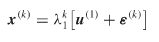
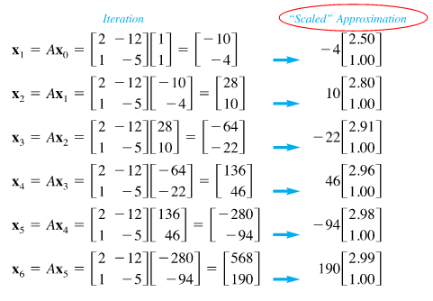

# Power Method and Eigenvalue Computation

- λ_1 is the dominant eigenvalue if it is the largest absolute value of them all

## Power Method
- Computes the highest eigenvalue

- u: eigenvector
- Au_i = λ_1u_i
- x_0 = c_1u_1 + c_2u_2 + ... + c_nu_n
- x_k = A(x_k-1) = (A_k)x_0
- 

## Example
- A = [2 -12 | 1 -5]
- x_0 = [1 1]
- 

## Rayleigh Quotient
- λ = (Ax . x) / (x . x)
- λ = (λx . x) / (x . x)
- λ = λ(x . x) / (x . x)