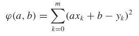
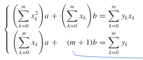
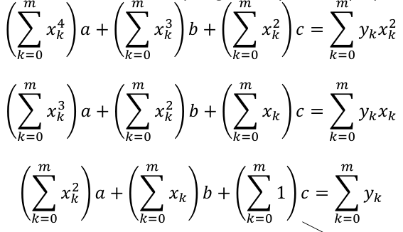
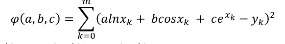

# Least Squares Method
- Conclude that the function is going to be linear
- Conclude that the failure is going to be on a straight line

# How
- Create table of x, y, x^2, xy
- Sum it up at the bottom
- 
- Take derivitives with respect to a, b
- 
- for (m+1), just replace with number of items
- This gets you 2 equations; solve them systems of equations
- Once you get a, b, fit to the y = mx+b form

# How (polynomials)
- Will hold form y = a + bx + cx^2 + ... + *x^k
- 
- Take derivitives with respect to a, b, c
- 
- This gets you 3 equations; solve them systems of equations
- Once you get a, b, c, fit to the y = a0 + a1x + ... form

# How (non-polynomials)
- Will hold form y = alnx + bcosx + ce^x
- 
- Take derivitives with respect to a, b, c
- 
- This gets you 3 equations; solve them systems of equations
- Once you get a, b, c, fit to the y = alnx + bcosx + ce^x form
