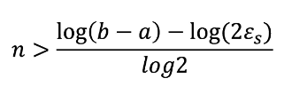

# Finding Roots: Bracketing Methods
- Bracketing means guessing two values of x that are between the root
- Open methods don't need this condition
- f(a) * f(b) should be less than 0
- f(a) positive, f(b) negative
- a < r < b and f(a)*f(b) < 0

## Special Cases
- No roots because never crosses
- Crosses axis multiple times (even or odd)
- Discontinuous functions

## Bisection Method
- Pick a and b that bound the root
- Construct midpoint: c = (a + b) / 2
- Evaluate f(c)
- If f(c) < 0, b = c and try again
- If f(c) > 0, a = c and try again
- If f(c) = 0, you found the root
- Relative error: (cn - cn-1) / cn
- Table with n, an, bn, cn, f(an), f(bn), f(cn), error
- f(c) should be getting closer to zero
- Pros: easy, at least 1 root, steps known beforehand
- Cons: slow, need a and b, multiple roots not guaranteed, flawed

### Getting number of iterations for Bisection
- Length of initial interval is L = (b - a)
- Error halves each time
- | r - cn | <= (b0 - a0) / (2n+1)
