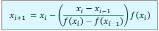

# Secant Method
- Requires two guesses between the root
- Does **not** have to be different signs!

# Modified Secant Method
- Instead of two guesses, one guess and one fractional value
  - If too small, round off error
  - If to big, inefficient
