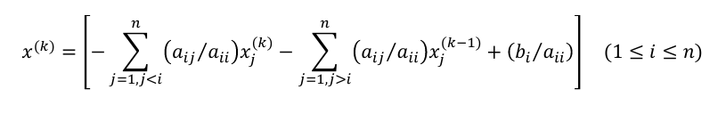
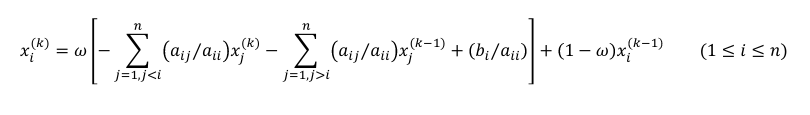

# Iterative Solutions to Linear Systems

## Jacobi Method
- Assume all diagonal elements are nonzero
  - If not the case; arrange for this

- Consider x0 = \[0, 0, 0, ...\]
- The more iterations, the more accurate
- Basically, that fancy sum function is just what you get when you isolate your variable
  - Ex: 7a + 1b -1c + 2d = 3
  - Solve for a = (3 - b + c - 2d)/7
  - Raise variables to the k power (aka, the value at the previous solution)

## Gauss-Seidel Method
- Successive version of Jacobi

- Takes less iterations to solve
- Same as the Jacobi, except instead of always copying the previous iteration's solution, when we solve for a variable, **use** it in the same iteration when it appears
  - For example, if you solve for x1, and x2 needs an x1, don't use x1^0, use that newly found x1^1
  - Same for other variables!

## Gauss-Seidel w/ SOR
- Add a relaxation factor (w)

- If w = 1, equivalent to [Gauss-Seidel Method](##-Gauss-Seidel-Method)
- Same as Gauss-Seidel, just with an added weight variable

## Convergence
- To converge starting vector, coefficient matrix

## Convergence Error Check
- Error = || x^k - x^(k-1) || / || x^k ||
